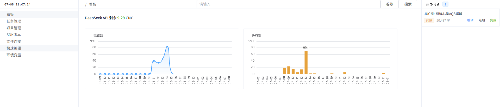
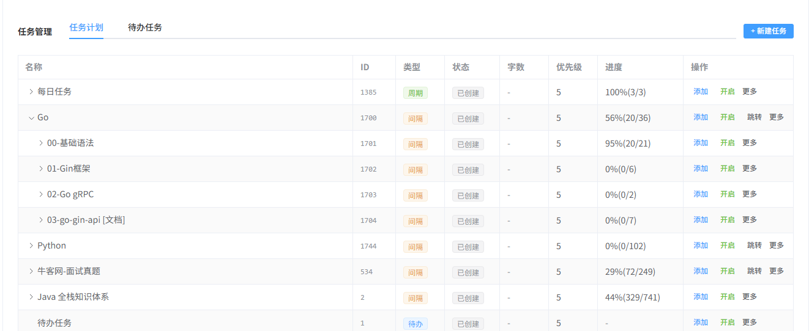
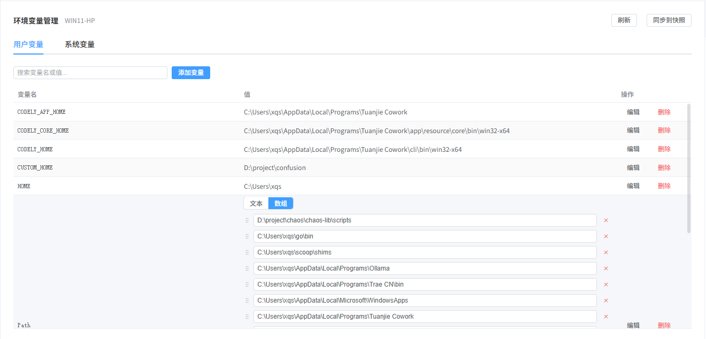
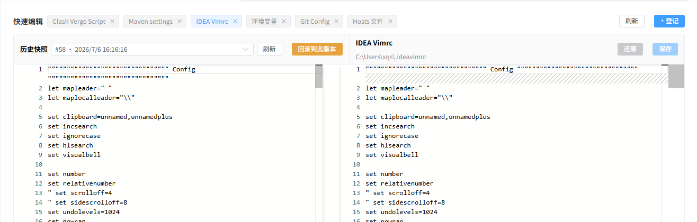
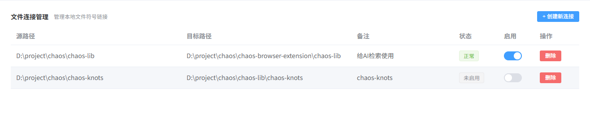
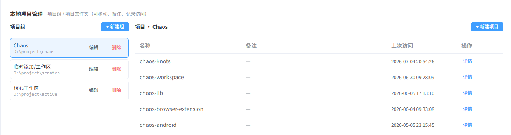
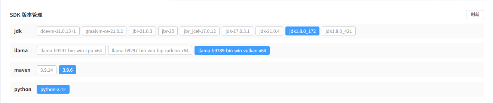

# chaos-lib

一个自托管的个人工具箱，集成了任务管理、知识卡片（FSRS 间隔复习）、文件连接、环境变量管理、快捷编辑等功能。

## 功能一览

- **📋 任务管理**：支持待办 / 定时（cron）/ 间隔复习三种计划类型，含 FSRS 算法驱动的间隔复习、逾期检测、父子任务树
- **📖 FSRS 知识卡片**：内嵌 FSRS（Free Spaced Repetition Scheduler）算法，自动计算下一个最佳复习时间
- **🔗 文件连接**：像符号链接一样管理本地文件路径映射
- **⚙️ 环境变量管理**：查看、修改、快照系统及用户环境变量（TOML 格式）
- **✏️ 快捷编辑**：被管控文件列表 + 内容历史快照，随时回滚
- **📁 项目组管理**：按目录组织本地项目，记录 Git URL、上次访问时间
- **📦 SDK 版本切换**：管理多个 SDK 安装版本并一键切换当前版本

## 截图展示

<p align="center"><b>📊 看板</b></p>
<p align="center"></p>

<p align="center"><b>📋 任务管理（含 FSRS 复习）</b></p>
<p align="center"></p>

<p align="center"><b>⚙️ 环境变量管理</b></p>
<p align="center"></p>

<p align="center"><b>✏️ 快捷编辑</b></p>
<p align="center"></p>

<p align="center"><b>🔗 文件连接</b></p>
<p align="center"></p>

<p align="center"><b>📁 项目管理</b></p>
<p align="center"></p>

<p align="center"><b>📦 SDK 版本切换</b></p>
<p align="center"></p>

## 技术栈

| 层 | 技术 |
|---|------|
| 后端 | Go 1.26 + Gin + GORM |
| 前端 | Vue 3 + TypeScript + Vite + Element Plus + ECharts |
| 数据库 | SQLite3（默认）/ PostgreSQL |
| 任务调度 | robfig/cron |

## 快速开始

### 准备工作

- Go 1.26+、pnpm（前端构建）

### 后端

```bash
cd chaos-server

# 复制配置模板（已内置 SQLite 默认值）
cp .env.example .env

# 运行（默认 SQLite，自动建表）
go run cmd/server/main.go -env=dev

# 或构建
go build -o chaos-server.exe cmd/server/main.go
```

### 前端构建并嵌入

后端通过 `//go:embed web` 内嵌前端静态文件。构建前端后，刷新二进制即可。

```bash
cd chaos-ui
pnpm install
pnpm build
```

## 配置

| 环境变量 | 说明 | 默认值 |
|----------|------|--------|
| `DB_TYPE` | 数据库类型：`sqlite` / `postgres` | `sqlite` |
| `DB_PATH` | SQLite 文件路径 | `data/chaos.db` |
| `DB_HOST` | PostgreSQL 主机 | `localhost` |
| `DB_PORT` | PostgreSQL 端口 | `5432` |
| `DB_USER` | PostgreSQL 用户 | `postgres` |
| `DB_PASSWORD` | PostgreSQL 密码 | - |
| `DB_NAME` | PostgreSQL 库名 | `chaos` |
| `SERVER_PORT` | HTTP 服务端口 | `8080` |
| `LOG_LEVEL` | 日志级别 | `info` |

详见 [`chaos-server/CONFIG.md`](chaos-server/CONFIG.md)。

## 项目结构

```
chaos-lib/
├── chaos-server/           # Go 后端
│   ├── cmd/server/         # HTTP 服务入口
│   ├── config/             # 配置与数据库初始化
│   ├── models/             # 数据模型
│   ├── routes/             # 路由定义
│   ├── services/           # 业务逻辑与 handlers
│   ├── tasks/              # 后台任务调度
│   └── tools/              # 工具函数（FSRS、端口转发、环境操作等）
├── chaos-ui/               # Vue 3 前端
├── sql/                    # DDL 脚本
└── scripts/                # 辅助脚本
```

## 参考

- [TypeWords](https://github.com/zyronon/TypeWords) — FSRS 间隔复习功能参考

## License

[MIT](LICENSE)
