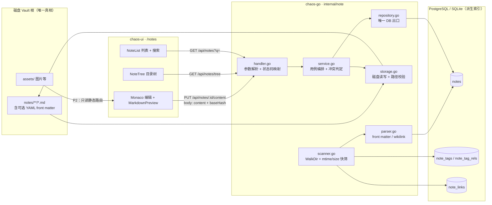
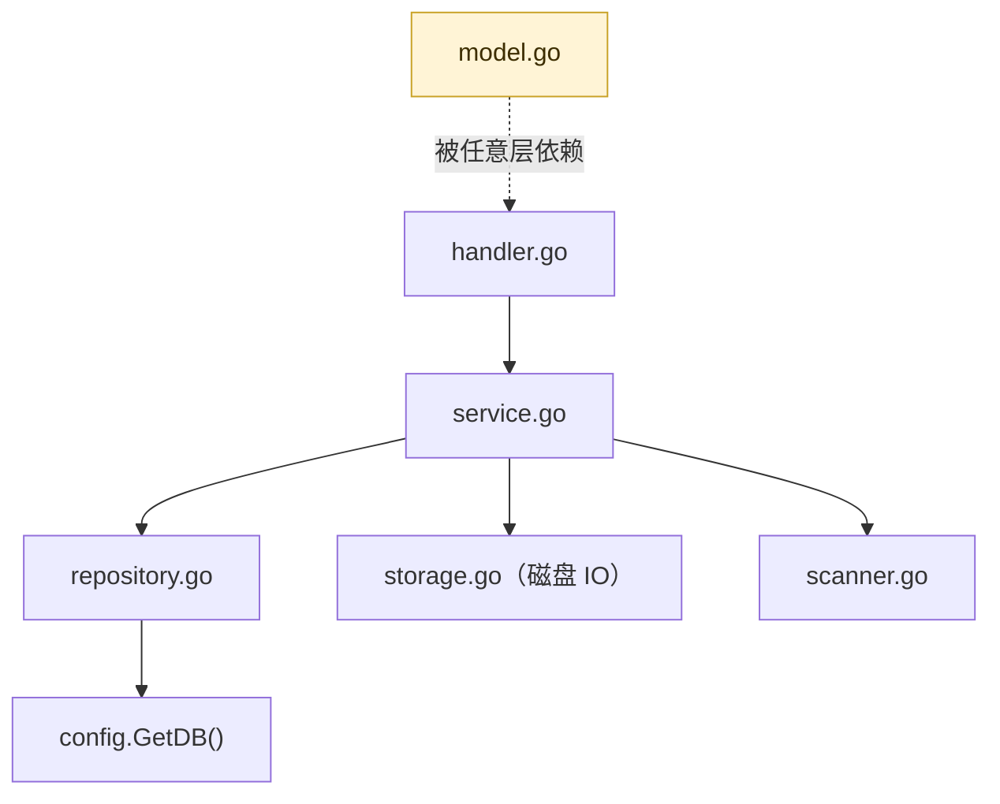
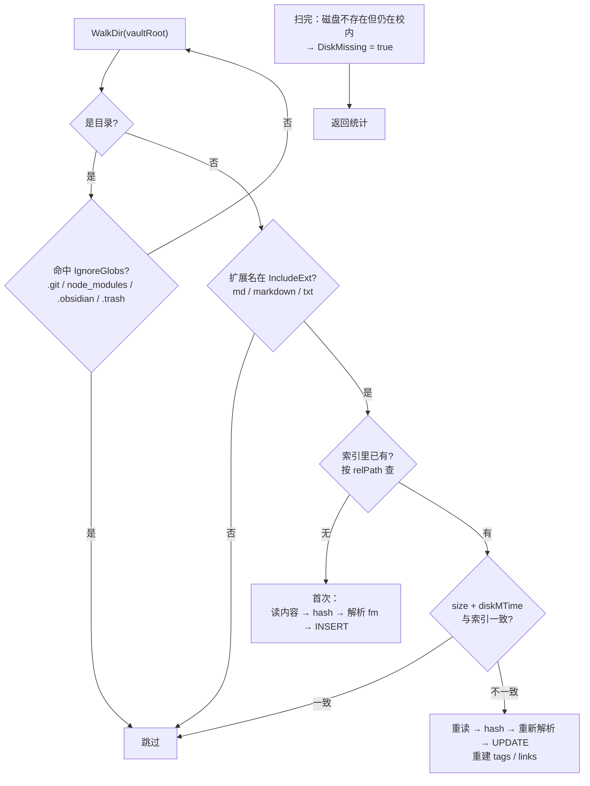
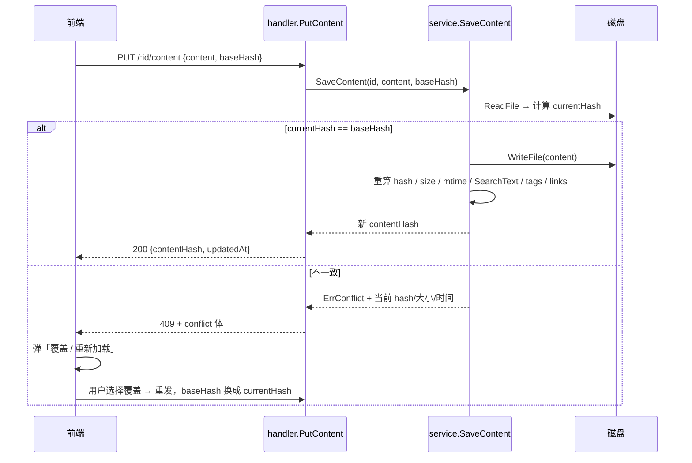

# 笔记模块设计方案（chaos-lib · `internal/note`）

> 文档状态：**待评审**
> 运行环境：Go 1.26.3 / Gin 1.12 / GORM 1.31 / Vue 3 + Vite 5 + Element Plus
> 修订日期：2026-10-04

## 0. 已确认的前置决策

| 编号 | 决策项 | 选择 |
|---|---|---|
| D0-1 | 落点 | `chaos-lib` 新增独立模块 `internal/note` |
| D0-2 | 真相源 | **文件优先**：磁盘 md 唯一真相，DB 存派生索引 |
| D0-3 | 管理范围 | 一期接一个**新建的独立测试目录**；表结构预留多 vault |
| D0-4 | 版本历史 | 依赖 vault 自身的 Git，一期不建独立快照表 |

## 1. 目标与非目标

### 1.1 目标

在 chaos-lib 内提供 Web 端 Markdown 笔记能力：**浏览目录树 → 编辑 → 保存回磁盘 → 检索**。
笔记文件始终是磁盘上的普通 `.md`，可被 Obsidian / VS Code / git 直接读写，离开 chaos-lib 依然完整。

### 1.2 非目标（一期明确不做）

| 不做 | 原因 |
|---|---|
| 所见即所得（WYSIWYG）编辑器 | 用 Monaco 双栏预览即可，成本与收益不成比例 |
| 图片 / 附件上传与改写 md 链接 | 引入二进制，需独立的 assets 路由与容量治理，放到 P2+ |
| 自建快照表 |  vault 是 git 仓库，历史交给 git（D0-4） |
| 双链图谱可视化、AI 摘要 | 属 P3/P4，前置数据与 UI 先留位 |
| 向量检索 | 依赖外部模型服务，与 self-hosted 轻量定位冲突 |

## 2. 核心设计决策

| 编号 | 决策 | 理由 | 代价 |
|---|---|---|---|
| D1 | **磁盘文件是唯一真相**，DB 只存派生索引 | 与 Obsidian/git 共存；DB 可随时全量重建 | 必须处理"外部修改"一致性（见 §7.2） |
| D2 | **DB 不存原始正文**，只存摘要 + 去标记纯文本 `SearchText` | 物理上杜绝"第二份真相" | 全文检索依赖派生字段，需随扫描刷新 |
| D3 | 索引表**物化 `ParentRel` 路径**，不每次 walk 磁盘 | 目录树/列表走 DB，响应稳定 | 移动/改名需级联更新子节点路径 |
| D4 | 标签写入口是 **DB 标签表**，front matter **只读不写回** | 避免每次编辑对文件做 diff 重写 | DB 标签不被其他 md 工具识别，导出需注意 |
| D5 | 保存走 **`baseHash` 乐观锁**，冲突必返回 409 | 不做这条一定丢内容 | 前端需实现冲突弹窗 |
| D6 | 一期检索用 **`ILIKE`**（PostgreSQL / SQLite 通用） | 几千篇规模足够，零新依赖、零迁移复杂度 | 无分词排序；规模上来后 P2 再上 tsvector/GIN |
| D7 | front matter 解析用 **`gopkg.in/yaml.v3`**（已在 `go.mod`） | 不引入新依赖 | 需自己切出 `---` 块，不能用通用 fm 库 |
| D8 | **不跟随符号链接**（junction / symlink） | 跟随即等于绕过 vault 边界限制 | vault 内若大量使用软链会漏扫，属可接受 |
| D9 | 一期**单 vault**（配置指定根目录），表留 `VaultID` | P0 最小闭环 | 多 vault 管理页推迟到 P2 |

## 3. 架构总览



依赖方向严格遵守 `AGENTS.md`「分层契约」，单向向下：



> 硬约束（沿用现有约定）：`config.GetDB()` 只允许出现在 `repository.go`；
> `model.go` 不碰任何 IO；`init()` 只做 `routehub.Register`，不起 goroutine、不播种数据。

## 4. 数据模型

### 4.1 `model.go`

```go
// Note 笔记索引项。本表是磁盘 Vault 的派生索引，删除后可通过重新扫描完整重建。
type Note struct {
    ID        int       `gorm:"primaryKey"`
    CreatedAt time.Time
    UpdatedAt time.Time
    IsDeleted bool      `gorm:"default:false" json:"-"`

    VaultID     int    `gorm:"uniqueIndex:idx_note_vault_path,priority:1"`
    // RelPath 相对 Vault 根的路径，分隔符统一 '/'
    RelPath     string `gorm:"uniqueIndex:idx_note_vault_path,priority:2"`
    // ParentRel 父目录相对路径，根目录为空串（物化，供目录树 / 过滤直接使用）
    ParentRel   string `gorm:"index:idx_note_parent"`
    Name        string // 文件名（含扩展名）
    Title       string `gorm:"index:idx_note_title"` // front matter.title → 首个 # → 文件名
    Summary     string // 去标记后的前 200 字
    SearchText  string `gorm:"type:text"` // 去标记纯文本，截断 64KB，仅用于检索（可重建）
    Format      string // md | markdown | txt | other
    SizeBytes   int
    ContentHash string // sha256，乐观并发基准
    DiskMTime   time.Time
    DiskMissing bool   // 磁盘文件消失（未直接删索引，防误判未挂载盘）
    Starred     bool
    WordCount   int
    TagNames    string // 冗余便于 LIKE 过滤；真值在 note_tag_rels
    IndexedAt   time.Time
}

func (Note) TableName() string { return "notes" }
```

| 字段 | 取值来源 | 说明 |
|---|---|---|
| `RelPath` | 扫描产生 | 唯一键之一；**系统内所有路径以此为准**，绝对路径只在 IO 瞬间推导 |
| `ParentRel` | 扫描产生 | 移动目录时须**级联更新所有后代**（见 §7.4） |
| `Title` | front matter → 首个 `#` → 文件名 | 三级兜底，保证永远非空 |
| `SearchText` | 去 Markdown 标记后的正文 | **派生缓存**，不参与任何业务逻辑判断 |
| `ContentHash` | sha256(原始字节) | 保存时做乐观锁基准；扫描时先比 `SizeBytes + DiskMTime` 快筛来省掉全量 hash |
| `DiskMissing` | 扫描置位 | UI 上标灰提示，不隐藏、不自动删索引 |

### 4.2 其余实体

```go
type NoteVault struct {          // 一期只有 1 行，P2 开放多 vault
    ID, Name, RootPath string    // RootPath 属本地敏感路径，只进未版本控制的 config.yaml
    IncludeExt, IgnoreGlobs string
    Enabled bool
}

type NoteTag struct { ID int; Name string `gorm:"uniqueIndex"` }

type NoteTagRel struct {          // 复合主键 (NoteID, TagID)
    NoteID int `gorm:"primaryKey"`
    TagID  int `gorm:"primaryKey"`
}

type NoteLink struct {            // [[双链]]，一期只采集成表，不做图谱
    ID        int
    SourceID  int
    TargetRef string              // 原文里的链接目标（标题或路径）
    Resolved  bool
}
```

### 4.3 迁移登记

1. `internal/app/app.go` 的 `config.AutoMigrate(...)` 追加 5 个模型。
2. `chaos-go/migrations/chaos_postgres_update.sql` 追加带日期与用途注释的增量 DDL；
   **不改动** `chaos_postgres_schema.sql`（基准快照，AGENTS.md 明令禁止改）。

> 注：`AGENTS.md` 里写的路径是 `sql/chaos_postgres_*.sql`，实际文件位于 `chaos-go/migrations/`，以实际目录为准。

## 5. 后端包结构

`chaos-go/internal/note/`：

| 文件 | 职责 | 要点 |
|---|---|---|
| `model.go` | 实体 + 领域错误哨兵 + 路径规范化纯函数 | 禁 IO。含 `ErrNoteNotFound` / `ErrInvalidPath` / `ErrPathEscapesVault` / `ErrConflict` / `ErrAlreadyExists` |
| `repository.go` | **唯一 DB 出口** | 只返回 `[]Note` / `*Note`；`config.GetDB()` 仅此文件 |
| `service.go` | 用例编排：`ListNotes` / `Tree` / `ReadContent` / `SaveContent` / `Create` / `Rename` / `Move` / `SoftDelete` / `ScanVault` | 冲突判定、事务边界都在这里 |
| `handler.go` | 参数解析 + 状态码映射 + `Register` | 用 `httpx.ParseID` / `httpx.MapError` + `ErrRule` 表，不自写 `strconv.Atoi` 与 switch |
| `dto.go` | `NoteResponse` / `SaveContentRequest` / `ConflictResponse` / `TreeNode` | 具名结构体优先，`gin.H` 仅限临时聚合 |
| `storage.go` | 磁盘读写 + 路径安全校验 | 对齐 `quickedit/storage.go` 的定位 |
| `scanner.go` | 遍历 + 快筛 + 增量判定 | 长耗时，须支持取消与互斥 |
| `parser.go` | front matter 切分、首标题提取、`[[wikilink]]` 提取、去标记纯文本 | 纯函数，放此处便于单测 |

**不创建** `worker.go` / `seed.go`：一期无后台 goroutine、无播种数据。

### 5.1 路由挂载

`handler.go`：

```go
func init() { routehub.Register("notes", Register) }

func Register(rg *gin.RouterGroup) {
    g := crud.Register[Note](rg, "notes", crud.Opts[Note]{
        Searchable:  []string{"title", "name", "summary", "search_text"},
        Sortable:    []string{"updated_at", "created_at", "title", "size_bytes"},
        // 路径 / 派生字段禁止通用 PATCH 绕过，必须走带副作用的专属路由
        Protected:   []string{"RelPath", "ParentRel", "ContentHash", "DiskMTime", "IndexedAt"},
        ToResponse:  ToNoteResponses,
        ListHandler: ListNotes, // 需支持目录过滤 + 全文关键词，覆盖基线 list
    })
    g.GET("/tree", GetTree)
    g.GET("/:id/content", GetContent)
    g.PUT("/:id/content", PutContent)
    g.POST("/:id/rename", RenameNote)
    g.POST("/:id/move", MoveNote)
    g.POST("/scan", ScanNotes)
    g.GET("/backlinks/:id", GetBacklinks)
}
```

然后在 `internal/app/app.go` 追加 `note "chaos-go/internal/note"`（或 blank import）以触发 `init`。
`router.go` **无需改动**（`routehub.MountAll` 自动挂载，见 `internal/router/router.go:34`）。

> 说明：`crud.Register` 已产出标准的 `{list, pagination}` 分页信封，正对 `useRestApi` 的解包约定；
> 这与 `quickedit`（手写 route、直接返回数组）不同，笔记模块遵循新基线。

## 6. API 契约

统一前缀 `/api/notes`。

### 6.1 基线路由（`crud.Register` 自动生成）

| 方法 | 路径 | 说明 |
|---|---|---|
| GET | `/api/notes` | 分页列表（被 `ListHandler` 覆盖，支持 §6.2 筛选参数） |
| GET | `/api/notes/:id` | 索引项详情（不含正文） |
| POST | `/api/notes` | 建笔记（落磁盘文件 + 索引） |
| PATCH | `/api/notes/:id` | 改元数据（`Starred` 等；路径类已 `Protected`） |
| DELETE | `/api/notes/:id` | 软删索引 + 磁盘文件移入回收站目录 |

### 6.2 列表额外 Query 参数

| 参数 | 说明 |
|---|---|
| `dir` | 目录相对路径，过滤该子树（空表示根） |
| `q` | 全文关键词，命中 `title` / `summary` / `search_text` |
| `tag` | 标签名精确过滤 |
| `starred` | 仅星标 |
| `missing` | 仅磁盘缺失项（排查用） |

### 6.3 自定义路由

| 方法 | 路径 | 请求 | 响应 | 错误码 |
|---|---|---|---|---|
| GET | `/tree` | — | `TreeNode[]` | 500 |
| GET | `/:id/content` | — | `{ content, contentHash, updatedAt, format }` | 404 不存在 |
| PUT | `/:id/content` | `{ content, baseHash }` | `{ contentHash, updatedAt }` | **409 冲突**（见 §7.2）/ 404 / 413 过大 |
| POST | `/:id/rename` | `{ name }` | `NoteResponse` | 400 非法路径 / **409 目标已存在** / 404 |
| POST | `/:id/move` | `{ targetDir }` | `NoteResponse` | 400 / 409 / 404 |
| POST | `/scan` | `{ full?: bool }` | `{ scanned, added, updated, missing, elapsedMs }` | 409 扫描进行中 |
| GET | `/backlinks/:id` | — | `NoteResponse[]` | 404 |

### 6.4 领域错误映射表（`ErrRule`）

| 哨兵 | 状态码 | 前端提示 |
|---|---|---|
| `ErrNoteNotFound` | 404 | 笔记不存在或已被移动 |
| `ErrInvalidPath` | 400 | 路径不合法 |
| `ErrPathEscapesVault` | 400 | 路径超出笔记库范围 |
| `ErrAlreadyExists` | 409 | 同名文件已存在 |
| `ErrConflict` | 409 | 文件已被外部修改 |
| `ErrContentTooLarge` | 413 | 文件过大，暂不支持在线编辑 |

### 6.5 409 冲突响应体

```jsonc
{
  "error": "文件已被外部修改（可能是 Obsidian / VS Code / git pull）",
  "conflict": {
    "baseHash":   "e3b0c442...",   // 客户端提交时的基准
    "currentHash":"9f86d081...",   // 磁盘当前值
    "currentSize": 2048,
    "diskUpdatedAt": "2026-10-04T12:34:56+08:00"
  }
}
```

前端据此弹「**覆盖磁盘版本** / **重新加载磁盘内容**」二选一——不允许静默覆盖。

## 7. 关键流程

### 7.1 扫描（增量）



要点：

- **快筛优先**：先比 `SizeBytes + DiskMTime`，只有变化才读文件内容、算 hash，避免大库全量重算。
- **缺失不断言**：文件消失只置 `DiskMissing`（外接盘未挂载时会整库消失）。
- **互斥**：包级 mutex 防并发扫描；第二个请求直接 409。
- **不跟随软链**（D8）。

### 7.2 保存与乐观锁



> **这是整个方案里唯一"不做就必定丢数据"的地方**，一期必须实现，不能简化。

### 7.3 路径安全（所有涉及路径的输入都要过这道）

```go
// resolveSafePath 把 Vault 内的相对路径解析为绝对路径；越界一律拒绝。
func resolveSafePath(root, rel string) (string, error) {
    if strings.Contains(rel, "\\") { rel = strings.ReplaceAll(rel, "\\", "/") }
    if strings.HasPrefix(rel, "/") || strings.Contains(rel, "..") {
        return "", ErrInvalidPath
    }
    if strings.ContainsAny(rel, "\x00") { return "", ErrInvalidPath }
    abs := filepath.Join(root, filepath.FromSlash(rel))
    if abs != root && !strings.HasPrefix(abs, root+string(os.PathSeparator)) {
        return "", ErrPathEscapesVault
    }
    return abs, nil
}
```

三条硬规则：拒绝 `..`、拒绝绝对路径输入、解析后必须仍在 vault 根之下。

### 7.4 移动 / 改名

- 目录移动须**级联更新后代的 `ParentRel` 与 `RelPath`**——这是 D3 物化路径的代价。
- 顺序遵循 AGENTS.md 第 6 条：**先做磁盘副作用，再落库**，失败需可补偿（记录日志并触发一次重扫即可回到一致状态）。
- 目标已存在 → `ErrAlreadyExists`，不静默覆盖（对齐 `project.MoveProject` 的做法）。

### 7.5 删除

- 不 `os.Remove`：移入 vault 下的 `.trash/`（并加进 `IgnoreGlobs`），保留文件名 + 时间戳后缀防撞名。
- 索引走 `IsDeleted` 软删；`trash` 内容本身由用户用 git 或文件管理器兜底（D0-4）。

### 7.6 搜索

| 引擎 | 实现 | 备注 |
|---|---|---|
| PostgreSQL（默认） | `title ILIKE ? OR summary ILIKE ? OR search_text ILIKE ?` | 一期够用（D6） |
| SQLite | 同上 `ILIKE` 查询（SQLite `LIKE` 本身对 ASCII 大小写不敏感） | 与 PostgreSQL 共用同一拼接条件 |
| P2 升级 | `tsvector + GIN`，新增生成列 + 索引 | 届时在 `update.sql` 追加 |

> 不引入外部 `rg`/`node-md-find` 类二进制——会给部署脚本增加负担。

## 8. 前端设计

### 8.1 布局（`/notes`）

```
┌─────────────┬───────────────────────┬──────────────────────────┐
│ 目录树       │ 列表                   │ 编辑 / 预览               │
│ NoteTree    │ NoteList               │ Monaco ⇄ MarkdownPreview │
│ 懒加载子节点 │ 搜索框 + 标签筛选       │ 双栏分屏， Ctrl+S 保存    │
│ [重新扫描]   │ 星标 / 大小 / 更新时间  │ [保存] [重命名] [删除]     │
└─────────────┴───────────────────────┴──────────────────────────┘
```

响应式：< 1280px 时目录树收起为抽屉。

### 8.2 文件清单

| 文件 | 说明 |
|---|---|
| `src/api/note.ts` | `interface Note` + `useRestApi<Note>('notes')` + 自定义函数（`tree` / `content` / `saveContent` / `rename` / `move` / `scan` / `backlinks`） |
| `src/views/Notes.vue` | 页面容器，三栏布局与状态编排 |
| `src/components/note/NoteTree.vue` | 目录树，`el-tree` 懒加载 |
| `src/components/note/NoteList.vue` | 列表 + 搜索，复用 `DataTable` 或轻量表格 |
| `src/components/note/NoteEditor.vue` | Monaco + 预览切换 + 保存 / 冲突处理 |
| `src/router/index.ts` | `appRoutes` 追加一条，`meta` 驱动菜单 |

```ts
// src/router/index.ts 追加
{
  path: '/notes',
  name: 'notes',
  component: () => import('@/views/Notes.vue'),
  meta: {title: '笔记', icon: 'Notebook'},
}
```

### 8.3 必须改造的既有组件

`src/components/MarkdownPreview.vue` 目前靠 **`rawLink` 的后缀**判断要不要走 Markdown 渲染：

```26:26:chaos-ui/src/components/MarkdownPreview.vue
  return url.endsWith('.md') || url.endsWith('.markdown')
```

笔记场景里 URL 是 `/api/notes/12/content`，没有 `.md` 后缀，会被误判成纯文本。
改造方式：新增显式 `format?: 'markdown' | 'text'` prop，**优先级高于 `rawLink` 推断**，`rawLink` 推断保留作兜底（不影响 `CenterPreview` / `ReviewDialog` 两个现有调用方）。

### 8.4 交互约定

- 请求统一走 `src/utils/request.ts`；提示/确认走 `src/utils/message.ts`；写操作走 `useCrudAction.ts` 的 `run()`。
- 编辑器统一 Monaco（AGENTS.md 既定）。
- **冲突处理**：收到 409 时进入「冲突态」横幅，提供覆盖 / 重载两个按钮，禁止自动重试覆盖。
- 自动草稿：编辑中未保存内容暂存 `sessionStorage`，刷新后提示恢复（一期可选，但建议做，成本极低）。

## 9. 配置

配置源是 **`configs/config.yaml`**（由 `internal/config/loader.go` 的 `LoadConfig()` 加载），
`.env` 在当前实现里**并未被读取**——新增配置一律走 yaml 段落，不新增 dotenv 依赖。

```go
// internal/config/loader.go
type NoteConfig struct {
    Enabled     bool   `yaml:"enabled"`       // 模块开关，缺省 false
    RootPath    string `yaml:"root_path"`     // Vault 根目录；本地敏感路径
    IncludeExt  string `yaml:"include_ext"`   // 逗号分隔，缺省 "md,markdown,txt"
    IgnoreGlobs string `yaml:"ignore_globs"`  // 缺省 ".git,node_modules,.obsidian,.trash,assets"
    MaxFileSize int    `yaml:"max_file_size"` // 单文件上限字节，缺省 2MB
}
// AppConfig 追加：Note NoteConfig `yaml:"note"`
```

- `defaultConfig()` 给缺省值；`NoteConfig.Available()` 判定是否可用（`Enabled && RootPath != ""`）。
- `configs/config.example.yaml` 同步追加，**只写占位值**（如 `<your-vault-root>`），严禁真实路径。
- 不可用时扫描接口返回明确错误而非崩溃，前端提示"未配置笔记库目录"。

## 10. 分期实施计划

### P0 · 骨架（目标：能看不能写）

- [ ] `internal/config/loader.go` 增 `NoteConfig` + `AppConfig.Note` + 缺省值
- [ ] `configs/config.example.yaml` 追加占位配置
- [ ] `internal/note/model.go`：4 个实体 + `TableName()` + 领域错误哨兵
- [ ] `internal/note/repository.go`：基础查询（列表 / 树 / 按路径 / CRUD）
- [ ] `internal/note/parser.go`：front matter 切分、标题提取、去标记纯文本
- [ ] `internal/note/scanner.go`：`WalkDir` + 快筛 + 增量判定 + 互斥
- [ ] `internal/note/service.go`：`ScanVault` / `Tree` / `List`
- [ ] `internal/note/handler.go` + `dto.go`：`Register` + tree/list/scan
- [ ] `internal/app/app.go`：`AutoMigrate` 登记 4 张表 + import note 包
- [ ] `migrations/chaos_postgres_update.sql` 追加增量 DDL
- [ ] 前端 `api/note.ts` + `Notes.vue` + `NoteTree.vue` + `NoteList.vue` + 路由
- [ ] **验收**：`go build ./...` 通过；测试目录 50 篇 md 扫描入库；目录树与列表正确；`pnpm build` 通过

### P1 · 读写闭环（目标：真正的可用）

- [ ] `internal/note/storage.go`：读写 + `resolveSafePath` 路径校验
- [ ] `service.go`：`ReadContent` / `SaveContent`（**含 `baseHash` 乐观锁**）/ `Create` / `Rename` / `SoftDelete`
- [ ] `handler.go`：`GET|PUT /:id/content`、rename、move，`httpx.MapError` + `ErrRule` 表
- [ ] 前端 `NoteEditor.vue`：Monaco + `MarkdownPreview` 双栏；`MarkdownPreview` 加 `format` prop
- [ ] 前端 409 冲突弹窗（"覆盖 / 重载"）
- [ ] `.trash/` 回收站 + `IgnoreGlobs` 追加
- [ ] **验收**：端到端编辑落盘；用外部编辑器改动后保存 → 正确弹冲突；路径 `../` 与绝对路径被拒

### P2 · 检索与组织

- [ ] 全文关键词 `q` 检索 + 标签筛选 + 星标
- [ ] `note_tags` / `note_tag_rels` 读写与 UI（多选标签）
- [ ] `POST /scan` 异步化 + 进度查询
- [ ] 定时任务自动重扫（`scheduler.Register`，默认关闭）
- [ ] `assets/` 只读静态路由（同样过 `resolveSafePath`），md 里图片可正常显示
- [ ] 多 vault 管理（沿用已预留的 `VaultID`）

### P3 · 知识库增强

- [ ] `[[wikilink]]` 采集 + `note_links` + 反向链接面板
- [ ] 移动 / 目录重命名的级联更新
- [ ] Git 联动：保存后自动 `add+commit`（开关控制，默认关）
- [ ] 模板 / 每日笔记

### P4 · AI

- [ ] 复用 `internal/deepseek`：摘要生成、标签建议、相似笔记推荐

## 11. 测试计划

> 临时脚本放 `chaos-go/.scratch/`，已被 `.gitignore` 忽略。

| 层 | 用例 |
|---|---|
| `parser_test.go` | front matter 有/无/畸形；无标题；`#` 在代码块内不误判为标题；`[[link]]` 提取 |
| `model_test.go` | `resolveSafePath`：`..`、绝对路径、`root` 自身、空串、NUL、大小写变体、**路径前缀欺骗**（`/vault` 与 `/vault-evil`） |
| `scanner_test.go` | 新增/修改/删除分别正确进入 added/updated/missing；`.git` 被忽略；软链不被跟随 |
| `service_test.go` | hash 一致→写成功；hash 不一致→`ErrConflict` 且不落盘；重命名目标存在→`ErrAlreadyExists`；移动目录级联更新后代 |
| 集成 | 跑 `go build ./...`；真实 vault 目录扫一遍确认计数；前端 409 流程手测 |

重点回归项：**任何写路径都必须校验 `baseHash`**；任何外部路径输入都必须过 `resolveSafePath`。

## 12. 风险登记

| 风险 | 影响 | 缓解 |
|---|---|---|
| 大库首扫慢（上千篇） | 接口超时 | 一期同步 + 小目录验证；P2 改异步 + 进度条；`MaxFileSize` 截断 |
| 外部工具同时编辑 | 内容丢失 | `baseHash` 乐观锁 + 保存前自动刷新 mtime 比对 |
| 移动目录后索引不同步 | 列表错乱 | 级联更新；出错即触发重扫自愈 |
| Windows 路径大小写 | 重复条目 | 统一 `filepath.FromSlash` + 以 `RelPath` 为唯一键（非大小写敏感比较在 DB 层由 collation 决定，一期接受） |
| 非 UTF-8 编码 | 乱码 | 扫描时校验，非法编码跳过并记录 warn 日志 |
| 敏感内容进索引 | 公开仓库泄密 | 见 §13 |

## 13. 公开仓库红线检查清单

本仓库对外可见，提交前逐项核对：

- [ ] `RootPath` 等本地路径**只出现在 `configs/config.yaml`**（已被 `.gitignore` 忽略），不进任何被版本控制的文件
- [ ] `config.example.yaml` / README 只用占位值 `<your-vault-root>`
- [ ] 文档、示例代码、日志片段中不出现真实用户名、主机名、内网 IP
- [ ] 截图（若补 `docs/screenshots/`）中的路径、标题、正文须脱敏
- [ ] 错误信息不外抛绝对路径：对外返回 `RelPath`，绝对路径只出现在服务端日志
